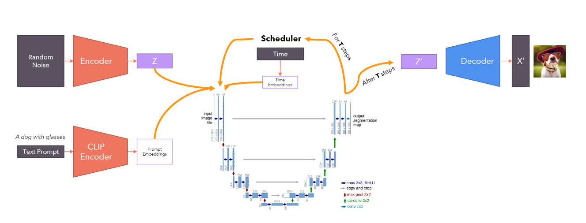
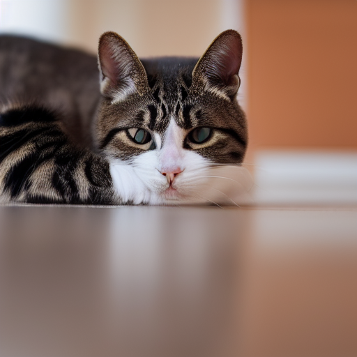

## pytorch-stable-diffusion
PyTorch implementation of Stable Diffusion from scratch

I test two park

text to picture

text and picture to picture 

this repo everythings follow this video

https://github.com/hkproj/pytorch-stable-diffusion/tree/main?tab=readme-ov-file